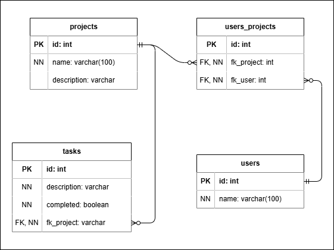

# Gerenciador de Projetos

Sistema web simples de gerenciamento de projetos, desenvolvido como atividade avaliativa da disciplina de WEB 3 do curso de Tecnologia em Análise e Desenvolvimento de Sistemas (TADS) do Instituto Federal do Paraná (IFPR).

Veja o Diagrama de Entidade e Relacionamento (DER):



## Prints

Veja [as prints do sistema](./docs/prints).

## Tecnologias

- Banco de dados PostgreSQL.
- Backend desenvolvido com NestJS e TypeORM.
- Frontend desenvolvido com Next.js, axios e iziToast.

## Instalação e execução

### Backend

> Dentro da pasta `backend`

Crie um arquivo `.env` baseado no arquivo `.env.example`:

```sh
DB_HOST = # Ex: localhost
DB_PORT = # Ex: 5432
DB_USER = # Ex: postgres
DB_PASS = # Ex: root
DB_NAME = # Ex: gerenciador_de_projetos

CORS_WHITELIST = # Ex: "http://localhost:3001"
PRODUCTION = # Ex: false

PORT = # Ex: 3000
```

Instale as dependências:

```sh
npm i
```

Gere a <i>build</i>:

```sh
npm run build
```

Execute a <i>build</i>:

```sh
npm run start:prod
```

### Frontend

> Dentro da pasta `frontend`

Crie um arquivo `.env` baseado no arquivo `.env.example`:

```sh
NEXT_PUBLIC_BACKEND_URL = # Ex: http://localhost:3000
```

Instale as dependências:

```sh
npm i
```

Gere a <i>build</i>:

```sh
npm run build
```

Execute a <i>build</i>:

```sh
npm run start
```

> O frontend está configurado para rodar na porta `3001`.

## Funcionalidades

### Usuários

A página de usuários lista todos os usuários do sistema. Você pode criar novos usuários clicando no botão "Novo usuário", acima da listagem.

#### Criando um usuário

Para a criação de um novo usuário, basta digitar seu nome no campo de texto e clicar no botão "Criar usuário".

### Projetos

A página de projetos lista todos os projetos do sistema. Você pode criar novos projetos clicando no botão "Novo projeto", acima da listagem.

#### Criando um projeto

Para a criação de um novo projeto, é necessário informar:

- O nome do projeto;
- Os usuários vinculados ao projeto (devem ter sido cadastrados previamente);

E, como informação adicional, você pode informar uma descrição para o projeto.

#### Editando um projeto

Para editar um projeto, clique em seu card na listagem. Na página do projeto, você pode clicar nos ícones de lápis ao lado dos respectivos campos para editá-los.

> Você também pode editar as tarefas do projeto facilmente. Veja a explicação das funcionalidades a respeito das tarefas para saber mais.

#### Excluindo um projeto

Para excluir um projeto, clique no ícone de lixeira do card do projeto, na listagem de projetos.

### Tarefas

A página de tarefas mostra todas as tarefas do sistema. Dentro da página de um projeto, são mostradas apenas as tarefas relacionadas àquele projeto. A edição ou exclusão de tarefas é igual tanto na página geral de tarefas quanto na página de um projeto.

#### Criando uma tarefa

Para criar uma tarefa, você precisa estar na página de um projeto, que será vinculado à tarefa criada.

Digite a descrição da tarefa no campo "Nova tarefa" e então clique fora dele. Você também pode facilmente criar várias tarefas em sequência apertando a tecla "Enter" após digitar a descrição. Isso criará a tarefa mas manterá o foco no <i>input</i> para que você digite a próxima tarefa.

Por padrão, as tarefas sempre são criadas como pendentes.

#### Editando uma tarefa

##### Concluída ou pendente

Para concluir uma tarefa, clique no ícone de <i>check-box</i>. Para marcá-la como pendente, clique novamente.

> O estado da tarefa é indicado pelo ícone de <i>check-box</i> vazio como "Pendente" e <i>check-box</i> preenchido como "Concluída". Além disso, a descrição de tarefas concluídas são cortados por um risco e têm opacidade reduzida.

##### Descrição

Para editar a descrição da tarefa, dê dois cliques rápidos em cima da mesma. Isso mudará o texto para um <i>input</i>. A nova descrição será salva ao clicar fora do campo ou pressionando a tecla "Enter". Caso queira cancelar a edição, aperte a teclas "Esc".

#### Excluindo uma tarefa

Para excluir uma tarefa, entre no modo de edição, clicando duas vezes rapidamente sobre a descriçao da mesma, e então clique no ícone de lixeira a direita do <i>input</i>.
